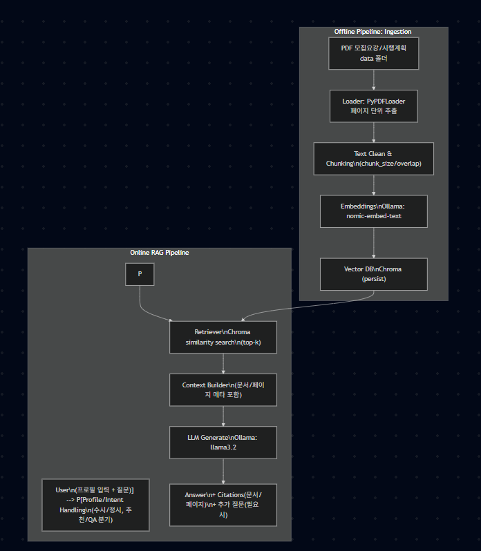

1) 가상환경 구축 매뉴얼 (Conda)
1-1. 사전 준비  

Python 추천 버전: 3.11  

Ollama 설치: Windows에 설치 후 실행(백그라운드 서버가 뜸)  

Ollama 모델 준비  
```
ollama pull llama3.2
ollama pull nomic-embed-text
```
1-2. 프로젝트 폴더 이동  
```
cd C:\Users\USER\Desktop\새싹\College_Plan_app
```

1-3. Conda 가상환경 생성/활성화  
```
conda create -n subproject_env python=3.11 -y
conda activate subproject_env
```

1-4. 필수 패키지 설치  
```
pip install -r requirements.txt
```

1-5. .env 설정 (로컬 실행용)  

프로젝트 루트에 .env 파일을 만들고 아래로 설정:
```
# 로컬에서 파이썬 ingest / streamlit을 직접 실행할 때는 localhost
OLLAMA_BASE_URL=http://localhost:11434

OLLAMA_CHAT_MODEL=llama3.2
OLLAMA_EMBED_MODEL=nomic-embed-text

DATA_DIR=./data
CHROMA_PERSIST_DIR=./vector_store/chroma_db
```

1-6. 문서 인덱싱(벡터DB 생성)  

data/ 폴더에 고려대 세종캠 요강 PDF 넣기
```
python -m src.ingest
``
자주 나는 에러 빠른 해결
```
No PDF files found
→ data/에 PDF가 없음

Failed to connect to Ollama
→ .env의 OLLAMA_BASE_URL이 host.docker.internal로 되어 있거나 Ollama 미실행

input length exceeds the context length
→ 청크가 너무 큼 → chunk_size/overlap 줄이면 해결
```
2) Streamlit 매뉴얼 (로컬 데모)
2-1. 로컬 실행(권장)  
```
가상환경 활성화 후:

conda activate subproject_env
cd C:\Users\USER\Desktop\새싹\College_Plan_app
streamlit run app.py
```

접속: http://localhost:8501  

2-2. Streamlit 사용 흐름(앱 UX 기준)  
좌측 사이드바: 사용자 프로필 입력(수시/정시, 내신/수능요약, 희망학과 등)  
중앙 채팅: 질문 입력(예: “세종캠 수시 수능최저 있어?”)  

2-3. Docker로 Streamlit 올리는 방법
- 로컬 파이썬 환경이 자주 꼬이거나, 재현 가능한 실행이 필요할 때  
- 도커 컨테이너 안에서 Ollama(호스트)를 호출해야 하므로:

```
OLLAMA_BASE_URL=http://host.docker.internal:11434

docker-compose.yml 예:

services:
  app:
    build: .
    ports:
      - "8501:8501"
    environment:
      OLLAMA_BASE_URL: "http://host.docker.internal:11434"
      OLLAMA_CHAT_MODEL: "llama3.2"
      OLLAMA_EMBED_MODEL: "nomic-embed-text"
      CHROMA_PERSIST_DIR: "./vector_store/chroma_db"
      DATA_DIR: "./data"
    volumes:
      - ./vector_store:/app/vector_store
      - ./data:/app/data

docker compose up --build
```  
3) Diagram 작성 (Dataflow)  

아래는 “고려대 세종캠 입시 챗봇”의 오프라인(색인) + 온라인(질의) 데이터 흐름도.  
  
**Dataflow 핵심 요약**  
- OFFLINE: PDF → 청킹 → 임베딩 → Chroma 저장(한 번 구축)  
- ONLINE: 질문/프로필 → 검색(top-k) → 근거 컨텍스트 구성 → LLM 답변 생성 → 출처 강제 출력